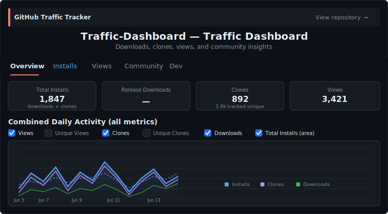

# Traffic Dashboard

  
  
  

  

  Built with AI assistance — see <a href="./CREDITS.md">CREDITS.md</a>
   
  

A reusable GitHub Actions workflow + HTML dashboard for tracking clone, download, and view statistics across repositories. Originally embedded in every repo individually — now consolidated here as a shared resource.

## Usage

### 1. Add the workflow

Copy [`.github/workflows/traffic-badges.yml`](.github/workflows/traffic-badges.yml) into your repo's `.github/workflows/` directory.

### 2. Configure secrets and variables

| Setting              | Type                | Description                                                                             |
| -------------------- | ------------------- | --------------------------------------------------------------------------------------- |
| `TRAFFIC_GIST_ID`    | Repository variable | Gist ID for storing badge state (auto-created on first run if empty)                    |
| `TRAFFIC_GIST_TOKEN` | Repository secret   | Fine-grained PAT with **Gists (R/W)**, **Traffic (R)**, and **Actions (R)** permissions |

### 3. (Optional) Deploy the dashboard

The [`index.html`](index.html) file is an HTML dashboard page. Serve it via GitHub Pages from the root for a visual overview.

## How it works

- Runs daily via cron and on push to `main`
- Tracks cumulative clone/download/view counts from the GitHub Traffic API
- Generates shields.io badge JSON files stored in a Gist
- Counts CI checkouts separately from organic clones
- Monthly archives saved to a separate archive Gist

## Files

| File                                                               | Purpose                                               |
| ------------------------------------------------------------------ | ----------------------------------------------------- |
| `.github/workflows/traffic-badges.yml`                             | Main workflow — collects stats, generates badges      |
| [`index.html`](https://b67687.github.io/Traffic-Dashboard/) | HTML dashboard for visual overview (served via Pages) |
